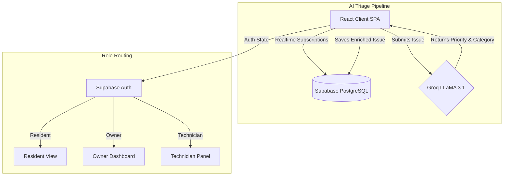

<div align="center">
  
# 🏨 EaseStay

**The Next-Generation AI-Powered PG & Community Management Platform**

[](https://react.dev/)
[](https://vitejs.dev/)
[](https://supabase.com/)
[](https://groq.com/)
[](https://tailwindcss.com/)

[**Features**](#-key-features) • [**Tech Stack**](#-tech-stack) • [**Architecture**](#-architecture) • [**Getting Started**](#-getting-started) • [**Deployment**](#-deployment)

</div>

---

## 🚀 Product Overview

EaseStay is not just a repository; it is a **fully functional, production-ready SaaS product** designed to revolutionize how Paying Guest (PG) accommodations, hostels, and residential communities operate. 

By leveraging state-of-the-art AI (Groq LLaMA 3.1) and real-time backend synchronization (Supabase), EaseStay eliminates the friction between residents facing issues and owners managing them. It introduces a seamless, voice-first issue reporting system that automatically prioritizes, categorizes, and alerts management of emergencies.

### 🎥 Product Demo


---

## ✨ Key Features

### 👤 For Residents (The Experience)
*   **Voice-First Reporting:** Ditch the long forms. Residents can use native browser Speech Recognition to describe an issue out loud.
*   **Real-time Tracking:** See exactly when a technician is assigned, when work begins, and when it is resolved, all updated in real time.
*   **Seamless Onboarding:** Join a community instantly using a secure 6-digit join code provided by the owner.

### 👑 For PG Owners (The Command Center)
*   **AI Auto-Triage:** Groq AI processes all incoming issues, automatically detecting categories (Plumbing, Electrical, etc.), setting priority levels, and flagging life-safety or structural emergencies.
*   **Community Management:** Create multiple communities, manage residents, and onboard technicians.
*   **Smart Assignments:** Assign technicians to specific issues with one click and track their progress via a Kanban-style workflow.
*   **Emergency Alerts:** Immediate notification badges and visual indicators for critical issues.

### 🛠️ For Technicians (The Workflow)
*   **Task Dashboard:** A distraction-free, role-specific dashboard displaying assigned work.
*   **One-Click Status Updates:** Easily move tickets from `Pending` to `In Progress` to `Resolved`.
*   **Video Coordination:** Optional built-in video-call coordination for remote troubleshooting.

---

## 💻 Tech Stack

We built EaseStay focusing on speed, scalability, and modern UI/UX paradigms:

*   **Frontend Framework:** React 19 + Vite 8
*   **Routing & State:** React Router + Redux Toolkit
*   **Styling:** Tailwind CSS 4 + Lucide React Icons
*   **Backend & Auth:** Supabase (PostgreSQL, Auth, Realtime Subscriptions)
*   **AI Engine:** Groq API (LLaMA 3.1 model for sub-second NLP processing)
*   **Hosting:** Vercel (Optimized SPA routing)

---

## 🧠 Architecture

EaseStay operates on a robust, role-based architecture protected by Supabase Row Level Security (RLS). 



---

## 🛠️ Getting Started

### Prerequisites

*   Node.js 18+
*   A [Supabase](https://supabase.com/) Project
*   A [Groq](https://console.groq.com/) API Key

### Installation

1.  **Clone the repository:**
    ```bash
    git clone https://github.com/your-username/EaseStay.git
    cd EaseStay
    ```

2.  **Install dependencies:**
    ```bash
    npm install
    ```

3.  **Configure Environment Variables:**
    Create a `.env` file in the root directory:
    ```env
    VITE_SUPABASE_URL=your_supabase_project_url
    VITE_SUPABASE_ANON_KEY=your_supabase_anon_key
    VITE_GROQ_API_KEY=your_groq_api_key
    ```

4.  **Database Setup:**
    Navigate to your Supabase SQL Editor and run the contents of `supabase/schema.sql` to generate the required tables, triggers, and Row Level Security (RLS) policies.

5.  **Start the Development Server:**
    ```bash
    npm run dev
    ```
    Your app will be running at `http://localhost:5173`.

---

## 🌐 Deployment

EaseStay is optimized for Vercel deployment. A `vercel.json` file is included in the project root to ensure React Router client-side routes (SPAs) do not return 404 errors on page reload.

1. Push your code to GitHub.
2. Connect your repository to Vercel.
3. Add the required Environment Variables (`VITE_SUPABASE_URL`, `VITE_SUPABASE_ANON_KEY`, `VITE_GROQ_API_KEY`) in the Vercel dashboard.
4. Deploy!

---

## 🔒 Security & Data Integrity

*   **Row-Level Security (RLS):** Policies are strictly enforced at the database level. A resident can only see their own issues, while an owner can see all issues within their specific community.
*   **Role Validation:** Role assignment (`resident`, `owner`, `worker`) is securely verified before loading application routes.

---

<div align="center">
  <i>Built to eliminate the chaos of community management.</i>
</div>
